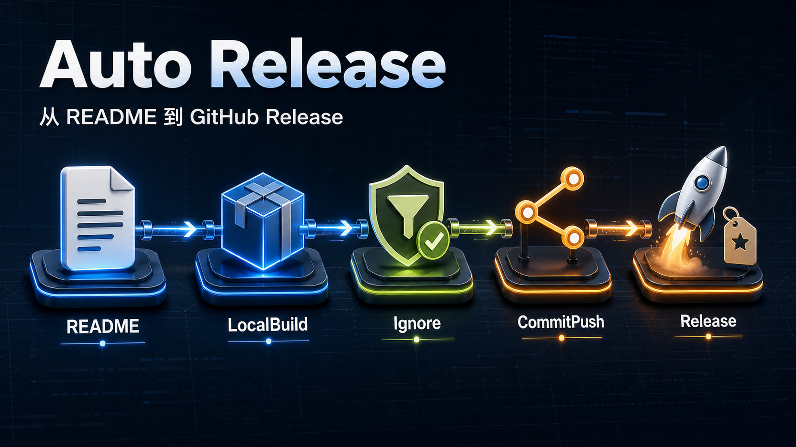

<div align="center">
  <h1>Auto Release</h1>
  <p>
    <a href="https://agentskills.io/specification"></a>
    <a href="#requirements"></a>
    <a href="./LICENSE"></a>
  </p>
  <p><a href="./README.md">简体中文</a> · <strong>English</strong></p>
</div>



Auto Release is a repository-delivery Skill for AI agents. It follows the open Agent Skills format and has been verified with Codex. Use natural language to optimize a README, build locally, audit Git ignore rules, classify and push commits, or publish a GitHub Release—with explicit change boundaries, dry-run previews, and failure protection at every step.

Auto Release supports 12 project types across applications, libraries, desktop, mobile, native, and container workloads. Describe the outcome you want; it identifies the repository and its readers before choosing a strategy. It does not treat a local build as a release, and it never commits or pushes without authorization.

Clients with native Agent Skills support can load `SKILL.md`. Other terminal-capable agents can invoke the scripts in `scripts/` explicitly, but that is not the same as native Skill discovery or a complete client integration.

## Quick start

### 1. Install in Codex (verified)

Run in PowerShell:

```powershell
python -X utf8 "$env:USERPROFILE\.codex\skills\.system\skill-installer\scripts\install-skill-from-github.py" `
  --repo suzeccc/auto-release `
  --path skills/auto-release
```

After installation, start a new Codex task so the Skill list refreshes.

For other tools with native Agent Skills support, use that tool's Skill installation or discovery flow to load [`skills/auto-release`](skills/auto-release/). Agents that only provide terminal access can invoke the PowerShell entry points explicitly.

### 2. Describe the outcome

In Codex or another compatible agent that has loaded this Skill, enter prompts such as:

```text
Optimize this project's README
Build locally without changing the version or committing
Audit the Git ignore rules
Review the current changes, split them into coherent commits, and push once
Publish v1.2.3
```

If the goal is ambiguous, the agent asks you to choose `README`, `LocalBuild`, `Ignore`, `CommitPush`, or `Release`. A request that only says "ignore" defaults to a read-only audit and does not modify `.gitignore`.

## Five workflows

| Operation | Best for | What it changes by default |
|---|---|---|
| `README` | Creating, restructuring, or auditing project documentation | Documentation only; no staging, commit, or push |
| `LocalBuild` | Verifying that the project builds locally | May generate local configuration and `output/` artifacts; no version change, commit, or push |
| `Ignore` | Finding missing rules, sensitive paths, and tracked generated files | Produces an audit plan only; applying rules requires confirmation |
| `CommitPush` | Committing the current safe changes and pushing the current branch | Creates one or more Git commits, followed by one push |
| `Release` | Publishing a stable semantic version | May update versions, build, commit, push a tag, and operate a GitHub Release |

### README

Auto Release first identifies the project type, primary readers, and their main task, then decides how to order the README. It verifies repository features, commands, links, images, license, and status, and only adds badges backed by a reliable source.

Detailed APIs, internal implementation notes, and long troubleshooting guides stay in `docs/` or reference documents so the README remains a focused project entry point.

### LocalBuild

A local build does not change the version, create commits, or access GitHub. Artifacts are copied to:

```text
output/<project-name><extension>
```

When both the source fingerprint and artifact SHA256 are unchanged, the previous result can be reused. An explicit request to force a rebuild bypasses the cache.

### Ignore

Ignore inspects root and nested `.gitignore` files, current Git state, toolchain caches, build outputs, Agent/IDE local state, test reports, and paths that require human judgment. In Agent Skill source repositories, it recognizes a valid `SKILL.md`, protects the complete Skill root, and handles the `.install-test/` local installation sandbox separately.

- `Audit`: generate a plan without changing files.
- `Apply`: add the confirmed rules.
- `ApplyAndUntrack`: add the rules and stop tracking the confirmed files while preserving their local copies.

Ignore does not commit, push, or rewrite Git history. See [Ignore audit and application](skills/auto-release/references/ignore.md) for the plan details.

### CommitPush

CommitPush checks staged, unstaged, deleted, and untracked files together and runs a built-in suspected-secret check. Single commits and `AutoSplit` groups always use Conventional Commits; they never switch to plain text, ticket prefixes, or Gitmoji based on repository history. Release version commits also use Conventional Commits, but they do not reuse CommitPush's stage-all behavior.

When changes contain multiple independent purposes, `AutoSplit` can create 2–4 transactional commits from a plan. The original branch is updated and pushed only after every group succeeds. If the changes cannot be classified reliably, it falls back to a single commit.

```text
feat: add automated release workflow
fix(release): repair failed tag publication
docs: update installation guide
```

### Release

Release follows `Plan → Prepare → ReleaseCommit → Publish`:

1. Validate the repository, branch, remote, version, and release notes, and require a clean working tree.
2. Update version files and run project tests and builds.
3. Inspect the local build result and allow only generated managed-automation files and configured version files into the release commit.
4. Commit the exact release-owned changes, create the tag, and push both atomically; do not create an empty commit when nothing changed.
5. Wait for the configured GitHub Actions workflow.
6. Validate the required release assets and create or publish the GitHub Release according to configuration.

Generated release workflows use draft Releases. If a project uses a custom `.codex-release.json` or a human-maintained workflow, review its publication mode and asset rules before a formal release.

## Supported projects

| Project type | Detection evidence | Typical release artifacts |
|---|---|---|
| Tauri | `src-tauri/tauri.conf.json` | Windows installer, macOS DMG, Linux packages |
| Node.js | `package.json` | npm `.tgz` |
| Go | `go.mod` | Windows, Linux, and macOS amd64/arm64 binaries |
| Python | `pyproject.toml`, `setup.py`, or `setup.cfg` | wheel, sdist |
| Rust | `Cargo.toml` | `.crate` |
| .NET | `.csproj` | `.nupkg` |
| Java | `pom.xml` or Gradle build files | `.jar` |
| CMake | `CMakeLists.txt` | Multi-architecture Windows, Linux, and macOS archives |
| Flutter | `pubspec.yaml` | Mobile, desktop, and Web builds |
| Android | Android Gradle project | APK, AAB |
| Electron | Electron `package.json` | Multi-architecture Windows, Linux, and macOS archives |
| Docker | `Dockerfile` | GHCR multi-architecture image and digest manifest |

Specialized application types take precedence. When several ordinary project manifests coexist, Auto Release stops and asks for an explicit `-ProjectType` instead of relying on an opaque detection order.

## Generated files and local state

Auto Release prepares configuration incrementally for each operation:

- A local-only build generates the `.codex-release.json` required for LocalBuild without creating a GitHub workflow.
- A formal release completes the publication configuration and creates a tag-triggered workflow.

Complete release automation usually involves:

```text
.codex-release.json              # Regenerable machine-local configuration
.github/workflows/release.yml    # Reviewable, committable managed workflow
.git/auto-release/               # Receipts and transaction plans stored only in Git metadata
```

`.codex-release.json` must remain local, be ignored by an exact `.gitignore` rule, and never be tracked by Git. If a legacy repository still tracks it, use `Ignore ApplyAndUntrack` to remove only its index entry without deleting the local file. The generated managed workflow is project content and should be reviewed and committed with the code. `.git/auto-release/` lives inside Git metadata and never becomes repository content.

## Existing workflow protection

If the target release workflow already exists without an Auto Release managed marker, generation stops instead of overwriting it. You can explicitly choose:

- `ReuseCompatible`: reuse a human-maintained workflow that already satisfies the tag trigger, permission, and draft Release requirements.
- `CreateSeparate`: preserve the existing workflow and create `.github/workflows/auto-release.yml`.
- `Stop`: leave the repository unchanged so you can resolve the conflict first.

Only files generated with an Auto Release managed marker may be updated automatically later.

## PowerShell entry points

For normal use, describe the goal to an agent that has loaded this Skill. For debugging, integration, or scripting, invoke the underlying entry points directly.

<details>
<summary>Project detection and initialization</summary>

```powershell
$setup = "$env:USERPROFILE\.codex\skills\auto-release\scripts\setup-project.ps1"

# Read-only detection
& $setup -Mode Detect -RepositoryRoot "<repository-root>"

# Generate local-build configuration only
& $setup -Mode GenerateLocal -RepositoryRoot "<repository-root>"

# Generate complete configuration and release workflow
& $setup -Mode Generate -RepositoryRoot "<repository-root>"

# Validate existing configuration
& $setup -Mode Validate -RepositoryRoot "<repository-root>"
```

</details>

<details>
<summary>Build, Ignore, commit, and release</summary>

```powershell
$invoke = "$env:USERPROFILE\.codex\skills\auto-release\scripts\invoke-release.ps1"

# Local build
& $invoke -Operation LocalBuild -RepositoryRoot "<repository-root>"
& $invoke -Operation LocalBuild -ForceRebuild -RepositoryRoot "<repository-root>"

# Ignore audit
& $invoke -Operation Ignore -IgnoreMode Audit -RepositoryRoot "<repository-root>"

# Apply a confirmed plan and stop tracking generated files
& $invoke -Operation Ignore -IgnoreMode ApplyAndUntrack -RepositoryRoot "<repository-root>"

# Single commit and push
& $invoke -Operation CommitPush `
  -PromptLanguage English `
  -Summary "docs: update project documentation" `
  -RepositoryRoot "<repository-root>"

# Create classified commits from an Agent-generated plan and push once
& $invoke -Operation CommitPush `
  -CommitStrategy AutoSplit `
  -PromptLanguage English `
  -CommitPlanPath "<repository-root>/.git/auto-release/commit-plan.json" `
  -RepositoryRoot "<repository-root>"

$notes = @"
## What's changed

- Added: the first user-visible change.
- Fixed: the second user-visible change.
"@

# Formal release
& $invoke -Operation Release `
  -Version v1.2.3 `
  -PromptLanguage English `
  -Summary "chore(release): release v1.2.3" `
  -ReleaseNotes $notes `
  -RepositoryRoot "<repository-root>"
```

</details>

The commit language follows the user prompt that triggered the operation: English prompts use `-PromptLanguage English`, Chinese prompts use `Chinese`, and an explicit language request takes precedence. If a mixed-language prompt is indeterminate, use `Auto` to analyze repository history. Subjects always use `type(scope): description` or `type: description`; type and scope remain in English, while only the description language changes. Every commit in an `AutoSplit` operation uses the same language.

Common options:

- `-WhatIf`: preview a unified operation without changing files, Git, or GitHub.
- `-OutputFormat Json`: return a single-line JSON result for automation.
- `-ProjectType`: select the project type explicitly when several manifests coexist.
- `-WorkflowPolicy ReuseCompatible|CreateSeparate`: decide how to handle a human-maintained release workflow.

See the [`.codex-release.json` configuration reference](skills/auto-release/references/config.md) for every field and plan format.

## Safety boundaries

- Never force-push, move, or overwrite an existing version tag.
- Stop when the remote branch is ahead or diverged; do not merge or rebase automatically.
- `Ignore` is read-only by default; applying rules or untracking files requires explicit confirmation.
- `CommitPush` and `Release` run heuristic sensitive-file checks, but these do not replace human review or a dedicated secret scanner.
- `Release` never absorbs existing feature or documentation changes; handle a dirty worktree with a separate `CommitPush` or manual commit first.
- `Release` changes the version, Git, and GitHub; use `-WhatIf` to inspect the plan before a formal run.
- Human-maintained workflows remain unchanged by default.

## Requirements

- A client with native Agent Skills support (Codex is verified), or an Agent/terminal environment that can invoke PowerShell scripts explicitly
- Windows PowerShell 5.1 or PowerShell 7+
- Git
- Python, when installing the Skill or publishing a Python project
- The target project's build tools, such as Node.js, Go, Rust, .NET SDK, JDK, Flutter, or Docker
- GitHub CLI `gh`, when accessing GitHub Actions or GitHub Releases

## Development and validation

The repository contract suite checks the Skill structure, configuration for all 12 project types, workflow templates, and major operation paths:

```powershell
& ".\skills\auto-release\tests\validate.ps1"
```

When maintaining the README, see the [README optimization reference](skills/auto-release/references/readme.md).

## License

[MIT](LICENSE)
